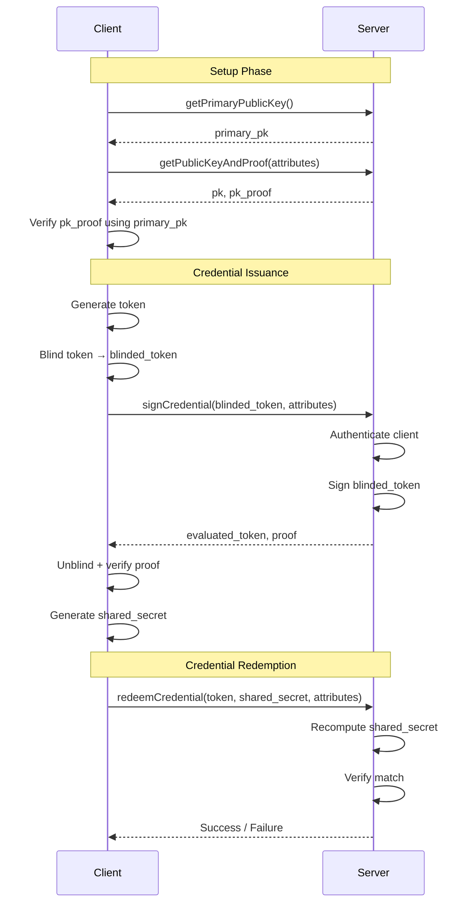

# AI Authentication Toolkit

[](LICENSE)
[]()
[]()

A comprehensive, production-ready toolkit for implementing privacy-preserving anonymous authentication systems. Built on advanced cryptographic primitives including **VOPRFs** (Verifiable Oblivious Pseudorandom Functions), **Blind Signatures**, and **Key Derivation Functions**.

> **⚠️ Disclaimer**: This is an independent open-source project and is **not affiliated with, endorsed by, or connected to Meta Platforms, Inc.** in any way. This implementation is based on publicly available cryptographic research and standards.

**Note**: Some source files may contain Meta copyright headers from the original reference implementation. This project is independently developed and maintained.

## 🌟 Key Features

### Privacy & Security
- **Zero-Knowledge Authentication**: Authenticate users without revealing or linking their identity
- **Anonymous Credentials**: Issue and verify credentials without tracking user activities
- **Unlinkability**: Multiple authentication sessions cannot be correlated to the same user
- **Cryptographic Proofs**: Built-in DLEQ proofs for verifiable correctness

### Performance & Scalability
- **Lightweight C Library**: Minimal dependencies (only libsodium required)
- **High Performance**: Optimized for low-latency operations
- **Production Ready**: Battle-tested cryptographic implementations
- **Multi-Tenant Support**: Designed for large-scale deployments

### Extensibility
- **Multiple Curve Support**: Ed25519 and Ristretto255 implementations
- **Pluggable Components**: Modular design for easy customization
- **Multiple VOPRF Modes**: Exponential and multiplicative blinding
- **Flexible KDF Options**: SDHI, Naor-Reingold, and default implementations

## 📋 Table of Contents

- [Overview](#overview)
- [Architecture](#architecture)
- [Quick Start](#quick-start)
- [Installation](#installation)
- [Usage Examples](#usage-examples)
- [API Reference](#api-reference)
- [Protocol Flow](#protocol-flow)
- [Security Considerations](#security-considerations)
- [Performance](#performance)
- [Contributing](#contributing)
- [License](#license)

## 🔍 Overview

The AI Authentication Toolkit enables privacy-preserving authentication through a cryptographic protocol that separates user identity from their authenticated sessions. This is achieved through:

1. **Token Blinding**: Clients blind tokens before sending to servers
2. **Blind Signing**: Servers sign blinded tokens without seeing the original
3. **Token Unblinding**: Clients unblind signed tokens and verify signatures
4. **Anonymous Redemption**: Clients redeem tokens without revealing identity

### Use Cases

- **Privacy-Preserving Analytics**: Authenticate users for analytics without tracking
- **Anonymous Voting Systems**: Verify voter eligibility without compromising ballot secrecy
- **Secure Credential Systems**: Issue credentials that can't be traced back to individuals
- **Rate Limiting**: Enforce usage limits without user tracking
- **Abuse Prevention**: Detect fraud while preserving user privacy
- **Decentralized Identity**: Implement anonymous authentication for Web3 applications

## 🏗️ Architecture

```
AI-auth-toolkit/
├── src/
│   ├── crypto/           # Core cryptographic library (C)
│   │   ├── curve/        # Elliptic curve implementations
│   │   │   ├── curve.h              # Abstract curve interface
│   │   │   ├── curve_ed25519.*      # Ed25519 curve
│   │   │   └── curve_ristretto.*    # Ristretto255 curve
│   │   ├── voprf/        # VOPRF implementations
│   │   │   ├── voprf.h              # VOPRF interface
│   │   │   ├── voprf_twohashdh.*    # Two-hash DH base
│   │   │   ├── voprf_mul_twohashdh.* # Multiplicative blinding
│   │   │   └── voprf_exp_twohashdh.* # Exponential blinding
│   │   ├── kdf/          # Key derivation functions
│   │   │   ├── kdf.h                # KDF interface
│   │   │   ├── kdf_sdhi.*           # SDHI KDF
│   │   │   ├── kdf_naor_reingold.*  # Naor-Reingold PRF
│   │   │   └── kdf_default.*        # Default KDF
│   │   └── dleqproof/    # Discrete log equality proofs
│   │       ├── dleqproof.h
│   │       └── dleqproof.c
│   └── service/          # Demo service implementation (C++)
│       ├── SimpleAnonCredClient.*        # Client implementation
│       ├── SimpleAnonCredServiceHandler.* # Server handler
│       ├── SimpleAnonCredServer.cpp       # Server main
│       ├── SimpleAnonCredClientDemo.cpp   # Client demo
│       └── SimpleAnonCredUtils.*          # Utility functions
├── tests/                # Unit tests
│   ├── dleqproof_test.cpp
│   ├── kdf_test.cpp
│   └── voprf_test.cpp
├── docs/                 # Documentation
├── examples/             # Example implementations
├── service.thrift        # Thrift API definition
├── Makefile             # Build configuration
└── Dockerfile           # Container setup
```

### Component Overview

#### Cryptographic Core (`src/crypto/`)

The cryptographic core is implemented in portable C and depends only on libsodium:

- **Curves**: Abstract interface supporting multiple elliptic curves
  - Ed25519: High-performance, widely adopted
  - Ristretto255: Prime-order group for advanced protocols
  
- **VOPRF**: Verifiable Oblivious PRF implementations
  - Two-Hash Diffie-Hellman construction
  - Both multiplicative and exponential blinding modes
  - Built-in DLEQ proofs for verifiability
  
- **KDF**: Key derivation for attribute-based keys
  - SDHI: Secure deterministic hierarchical instantiation
  - Naor-Reingold: Pseudorandom function family
  - Default: Standard KDF for general use
  
- **DLEQ Proofs**: Zero-knowledge proofs of discrete log equality
  - Schnorr-based construction
  - Fiat-Shamir transformation for non-interactivity

#### Service Layer (`src/service/`)

Reference implementation of an Anonymous Credential Service using Apache Thrift:

- **Server**: Multi-threaded service handler
- **Client**: Full-featured client library
- **Utils**: Encoding, serialization, and helper functions

## 🚀 Quick Start

### Using Docker (Recommended)

The fastest way to try out the toolkit:

```bash
# Build the Docker image
docker build -t ai-auth-toolkit . --build-arg UBUNTU_VERSION=22.04

# Run the server
docker run --rm --init --name acs-server ai-auth-toolkit

# In another terminal, run the client
docker exec acs-server client
```

### Local Build

If you have dependencies installed:

```bash
# Clone the repository
git clone https://github.com/elaineyu1031/AI-auth-toolkit.git
cd AI-auth-toolkit

# Build everything
make

# Run the server
./server

# In another terminal, run the client
./client
```

## 📦 Installation

### Prerequisites

#### Required Dependencies

- **C/C++ Compiler**: GCC 7+ or Clang 5+
- **libsodium**: Modern, easy-to-use crypto library
  ```bash
  # Ubuntu/Debian
  sudo apt-get install libsodium-dev
  
  # macOS
  brew install libsodium
  
  # From source
  git clone https://github.com/jedisct1/libsodium.git
  cd libsodium
  ./configure && make && sudo make install
  ```

#### For Demo Service

- **Apache Thrift 0.16+**: RPC framework
  ```bash
  # Ubuntu/Debian
  sudo apt-get install thrift-compiler libthrift-dev
  
  # macOS
  brew install thrift
  
  # From source
  # See https://thrift.apache.org/docs/install/
  ```

### Building

```bash
# Build server and client
make

# Build tests only
make tests

# Clean build artifacts
make clean
```

### Build Targets

- `make` or `make all`: Build server and client
- `make tests`: Build all unit tests
- `make server`: Build server only
- `make client`: Build client only
- `make clean`: Remove all build artifacts

## 💡 Usage Examples

### Basic Client-Server Flow

```cpp
#include "src/service/SimpleAnonCredClient.h"
#include "src/service/SimpleAnonCredServiceHandler.h"

// 1. Initialize client
auto transport = std::make_shared<TSocket>("localhost", 9090);
auto protocol = std::make_shared<TBinaryProtocol>(transport);
SimpleAnonCredClient client(protocol);
transport->open();

// 2. Get primary public key (optional, for key validation)
client.getPrimaryPublicKey();

// 3. Get attribute-specific public key
std::vector<std::string> attributes = {"app_name", "2024-01"};
client.getPublicKey(attributes);

// 4. Request credential signing
std::string token = generateRandomToken();
client.getCredential(token, attributes);

// 5. Redeem the credential
client.redeemCredential(token, attributes);
```

### Using the Crypto Library Directly

```c
#include "src/crypto/curve/curve_ristretto.h"
#include "src/crypto/voprf/voprf_mul_twohashdh.h"

// Initialize curve and VOPRF
curve_t curve;
curve_ristretto_init(&curve);
voprf_t voprf;
voprf_mul_twohashdh_init(&voprf, &curve);

// Server: Generate key pair
unsigned char sk[32], pk[32];
voprf.setup(&voprf, sk, sizeof(sk), pk, sizeof(pk));

// Client: Blind a token
unsigned char token[32];
randombytes_buf(token, sizeof(token));

unsigned char blinded_element[32];
unsigned char blinding_factor[32];
voprf.blind(&voprf, 
    blinded_element, sizeof(blinded_element),
    blinding_factor, sizeof(blinding_factor),
    token, sizeof(token));

// Server: Evaluate blinded element
unsigned char evaluated_element[32];
unsigned char proof_c[32], proof_s[32];
voprf.evaluate(&voprf,
    evaluated_element, sizeof(evaluated_element),
    proof_c, sizeof(proof_c),
    proof_s, sizeof(proof_s),
    sk, sizeof(sk),
    blinded_element, sizeof(blinded_element),
    1); // Generate proof

// Client: Unblind and verify
unsigned char unblinded_element[32];
voprf.verifiable_unblind(&voprf,
    unblinded_element, sizeof(unblinded_element),
    proof_c, sizeof(proof_c),
    proof_s, sizeof(proof_s),
    blinding_factor, sizeof(blinding_factor),
    evaluated_element, sizeof(evaluated_element),
    blinded_element, sizeof(blinded_element),
    pk, sizeof(pk),
    1); // Verify proof

// Finalize to get shared secret
unsigned char shared_secret[64];
voprf.client_finalize(&voprf,
    shared_secret, sizeof(shared_secret),
    token, sizeof(token),
    unblinded_element, sizeof(unblinded_element));
```

### Key Derivation Example

```c
#include "src/crypto/kdf/kdf_sdhi.h"

// Initialize KDF
curve_t curve;
curve_ristretto_init(&curve);
kdf_t kdf;
kdf_sdhi_init(&kdf, &curve);

// Setup with master secret
unsigned char master_secret[32];
randombytes_buf(master_secret, sizeof(master_secret));
kdf.setup(&kdf, master_secret, sizeof(master_secret));

// Derive key from attributes
const char* attrs[] = {"user_type:premium", "region:us-west"};
unsigned char derived_sk[32], derived_pk[32], pk_proof[64];

kdf.derive_key_pair(&kdf,
    derived_sk, sizeof(derived_sk),
    derived_pk, sizeof(derived_pk),
    pk_proof, sizeof(pk_proof),
    (const unsigned char**)attrs, 2);
```

## 📖 API Reference

For detailed API documentation, see [docs/API.md](docs/API.md).

### Core VOPRF Functions

| Function | Description |
|----------|-------------|
| `setup()` | Generate server key pair |
| `blind()` | Client blinds a token |
| `evaluate()` | Server signs blinded token |
| `verifiable_unblind()` | Client unblinds and verifies |
| `client_finalize()` | Generate shared secret (client) |
| `server_finalize()` | Generate shared secret (server) |

### Service API (Thrift)

| Method | Description |
|--------|-------------|
| `getPrimaryPublicKey()` | Retrieve server's primary public key |
| `getPublicKeyAndProof()` | Get attribute-specific public key + proof |
| `signCredential()` | Sign a blinded credential |
| `redeemCredential()` | Redeem and validate a credential |

## 🔄 Protocol Flow

### Complete Authentication Cycle



### Detailed Steps

1. **Setup** (Optional but Recommended)
   - Client retrieves and stores server's primary public key
   - Used to verify all subsequently retrieved public keys
   - Prevents key substitution attacks

2. **Key Retrieval**
   - Client requests public key for specific attributes (e.g., "app_id", "date")
   - Server derives key pair from attributes using KDF
   - Server returns public key + DLEQ proof
   - Client verifies proof against primary key

3. **Token Issuance**
   - Client generates random token
   - Client blinds token using VOPRF
   - Client sends blinded token to server
   - Server authenticates client (separate mechanism)
   - Server signs blinded token
   - Server returns signed token + proof
   - Client unblinds and verifies signature

4. **Token Redemption**
   - Client finalizes token to get shared secret
   - Client sends original token + shared secret to server
   - Server recomputes shared secret from token
   - Server verifies secrets match
   - Server proceeds with business logic

## 🔒 Security Considerations

### Cryptographic Guarantees

- **Unlinkability**: Server cannot link issuance and redemption
- **Unforgeability**: Only server can produce valid signatures
- **Blindness**: Server learns nothing about the token
- **Verifiability**: Client can verify server's signatures
- **One-More Forgery Resistance**: Client cannot produce extra valid tokens

### Implementation Security

- Uses libsodium for constant-time operations
- Secure random number generation via `randombytes_buf()`
- No secret-dependent branching or memory access
- Proper zeroing of sensitive memory

### Best Practices

1. **Key Management**
   - Rotate master keys regularly
   - Use attribute-based key derivation
   - Store keys in secure key management systems (HSM/KMS)

2. **Token Generation**
   - Always use cryptographically secure random tokens
   - Minimum 128 bits of entropy
   - Never reuse tokens

3. **Transport Security**
   - Always use TLS for client-server communication
   - Implement mutual authentication
   - Use certificate pinning where possible

4. **Rate Limiting**
   - Limit credential issuance per client
   - Implement exponential backoff
   - Monitor for abuse patterns

5. **Attribute Design**
   - Include time-based attributes (e.g., date, hour)
   - Use specific, narrow scopes
   - Implement attribute expiry

### Known Limitations

- Server must maintain state for double-spend prevention
- Requires separate client authentication mechanism
- Not quantum-resistant (uses elliptic curves)

## ⚡ Performance

### Benchmarks

Measured on: Intel Core i7-9750H @ 2.60GHz, Ubuntu 22.04

| Operation | Time (µs) | Throughput (ops/sec) |
|-----------|-----------|---------------------|
| Key Generation | ~50 | 20,000 |
| Token Blinding | ~80 | 12,500 |
| Token Evaluation | ~90 | 11,100 |
| Token Unblinding | ~110 | 9,090 |
| Finalization | ~45 | 22,200 |
| **Full Cycle** | **~375** | **~2,600** |

### Optimization Tips

1. **Batch Operations**: Process multiple tokens in parallel
2. **Key Caching**: Cache derived keys for common attributes
3. **Connection Pooling**: Reuse Thrift connections
4. **Async I/O**: Use non-blocking I/O for network operations
5. **Curve Selection**: Ristretto255 offers better performance

## 🧪 Testing

```bash
# Build tests
make tests

# Run all tests
./tests/dleqproof_test
./tests/kdf_test
./tests/voprf_test

# Run with verbose output
./tests/voprf_test --verbose
```

### Test Coverage

- **Unit Tests**: Individual component testing
- **Integration Tests**: Full protocol flow testing
- **Security Tests**: Verification of cryptographic properties
- **Performance Tests**: Benchmarking critical paths

## 🤝 Contributing

We welcome contributions! Please see [CONTRIBUTING.md](CONTRIBUTING.md) for guidelines.

### Development Setup

```bash
# Clone the repository
git clone https://github.com/elaineyu1031/AI-auth-toolkit.git
cd AI-auth-toolkit

# Create a development branch
git checkout -b feature/your-feature-name

# Make changes and test
make clean && make && make tests

# Run all tests
./tests/dleqproof_test && ./tests/kdf_test && ./tests/voprf_test

# Submit a pull request
```

### Code Style

- C code: Follow kernel style guidelines
- C++ code: Follow Google C++ style guide
- Document all public APIs
- Include unit tests for new features

## 📄 License

This project is licensed under the MIT License - see the [LICENSE](LICENSE) file for details.

**Note**: Some source files contain copyright headers from Meta Platforms, Inc. as they were derived from publicly available reference implementations. This project is independently developed and not affiliated with Meta.

## 🙏 Acknowledgments

- Built on [libsodium](https://libsodium.org/) - Modern cryptographic library
- Uses [Apache Thrift](https://thrift.apache.org/) for RPC framework
- Implements cryptographic protocols based on academic research and IETF standards
- Community contributors and open-source cryptography research

## 📚 Further Reading

- [VOPRF IETF RFC Draft](https://datatracker.ietf.org/doc/html/draft-irtf-cfrg-voprf) - Official VOPRF specification
- [Privacy Pass Protocol](https://privacypass.github.io/) - Related anonymous credential protocol
- [Ristretto Group](https://ristretto.group/) - Prime-order elliptic curve group
- [libsodium Documentation](https://doc.libsodium.org/) - Cryptographic primitives
- [Anonymous Credentials: A Survey](https://eprint.iacr.org/2013/516.pdf) - Academic overview

## 📧 Contact & Support

- **Issues**: [GitHub Issues](https://github.com/elaineyu1031/AI-auth-toolkit/issues)
- **Discussions**: [GitHub Discussions](https://github.com/elaineyu1031/AI-auth-toolkit/discussions)
- **Security**: Report security vulnerabilities privately to the maintainers
- **Maintainer**: [@elaineyu1031](https://github.com/elaineyu1031)

## ⚖️ Legal

This is an independent open-source project. It is **not affiliated with, endorsed by, or sponsored by Meta Platforms, Inc.** or any other organization. 

The project implements standard cryptographic protocols based on public research and IETF specifications. Some reference implementations were consulted during development, and appropriate attribution is maintained in source files as required by their respective licenses.

---

**Built with ❤️ for privacy-preserving authentication by the open-source community**
